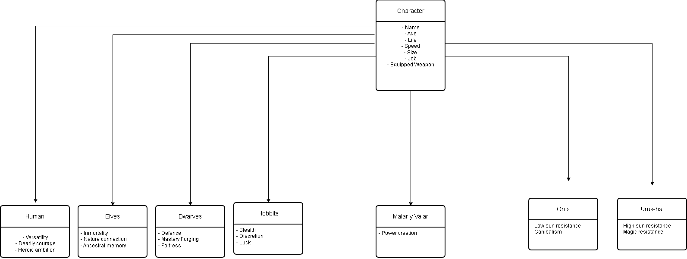

# El señor de los anillos Java



## Diagrama de Clases (**Jerarquia**)
## Description
Ejercicio desarrollado en Java dónde el objetivo principal es crear clases para cada raza del señor de los anillos y una super clase Personaje.
La finalidad es practicar el polimorfismo, la herencia y el encapsulamiento, 3 de los principales pilares de la programación orientada a objetos (POO).

## Estructura del proyecto
```
LordRingsExcercise/
├── src/
│   ├── main/
│   │   ├── java/
│   │   │   └── org.example/
│   │   │       ├── alignment/          # Clasificación por razas
│   │   │       │   ├── evil/           
│   │   │       │   │   ├── Orc.java
│   │   │       │   │   └── Urukhai.java
│   │   │       │   ├── good/          
│   │   │       │   │   ├── Dwarve.java
│   │   │       │   │   ├── Elve.java
│   │   │       │   │   ├── Hobbit.java
│   │   │       │   │   └── Human.java
│   │   │       │   └── neutral/        
│   │   │       │       └── MaiarValar.java
│   │   │       ├── character/          # Lógica base
│   │   │       │   └── Character.java  # Clase padre / Interfaz
│   │   │       └── Main.java          
│   │   └── resources/                  
│   └── test/                           
├── target/                            
├── .gitignore
└── pom.xml                             
```

## Conceptos aplicados de la Programación orientada a objetos
### Encapsulación
El objetivo principal es ocultar la información interna de un objeto y exponer sólo los datos necesarios a través de métodos especiales llamados **Getters** y **Setters**. Todos los atributos van en privado.
### Herencia
El objetivo principal es que una clasehija (**subclase**) reciba atributos/métodos de otra clase padre (**super clase**).
### Poliformismo
El objetivo principal es que un objeto puede comportarse de muchas maneras diferentes aunque compoartan la misma herencia.
